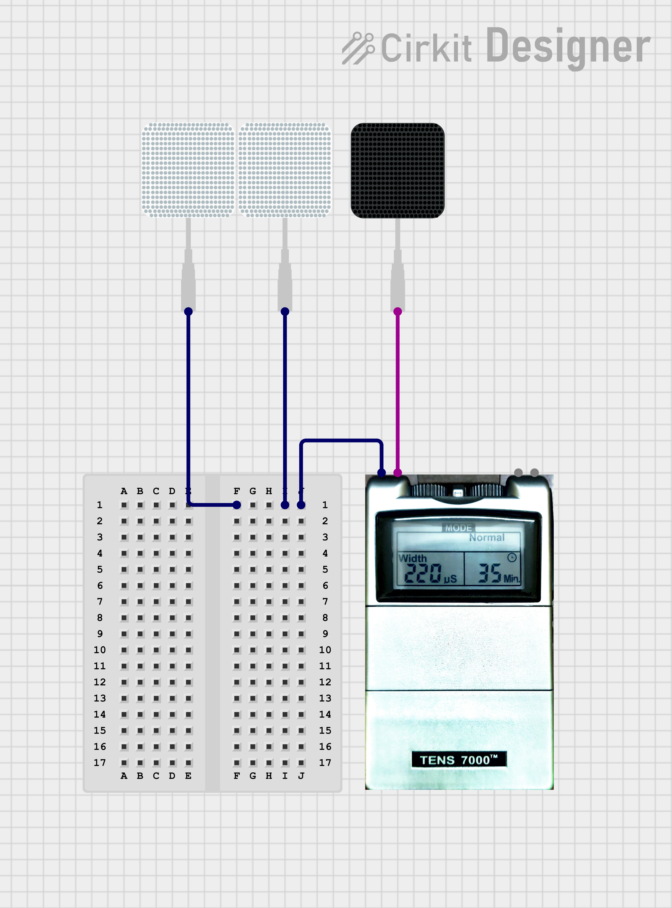

# EMS Social Games

This is the repository for TouchMate, a social EMS bodily game based on physical touch.

## Setting up the EMS

The EMS circuit for the game involves splitting the positive electrode from a channel into two positive electrodes, so that the two electrodes share a common reference electrode.

The circuit design is as shown in the image below.

## Playing the Game

To start the game, select "Who Touched" from the main menu on the app. Select the number of players (3), and enter their names.

The game then assigns the role of "guesser" to one player, making the other players the "suspects". Sit at the table such that the guesser is on one side and the suspects are on the other side, and make sure the guesser's electrode is connected to the reference. When you're ready, hit the start button, and the suspects now touch the guesser turn-by-turn, with the guesser trying to determine who touched them by observing the finger movements.

The game keeps track of the time, and at the end of five minutes, shows the players' scores. It then assigns a new player as the guesser, and you must then switch places so that the new guesser is alone on one side of the table. The wire for the ground electrode must also be switched to the guesser's electrode (you don't need to remove the electrode itself, only the connections). If you're doing this with the EMS device ON (helpful so that you don't have to perform the calibration again), make sure you do NOT touch the metal part of the electrode with your hand while making direct skin-to-skin contact with another player.

Play the next round for five minutes, and follow similar steps as above when the third player gets assigned the role of the guesser.